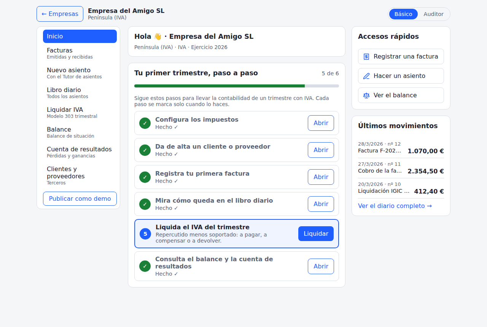
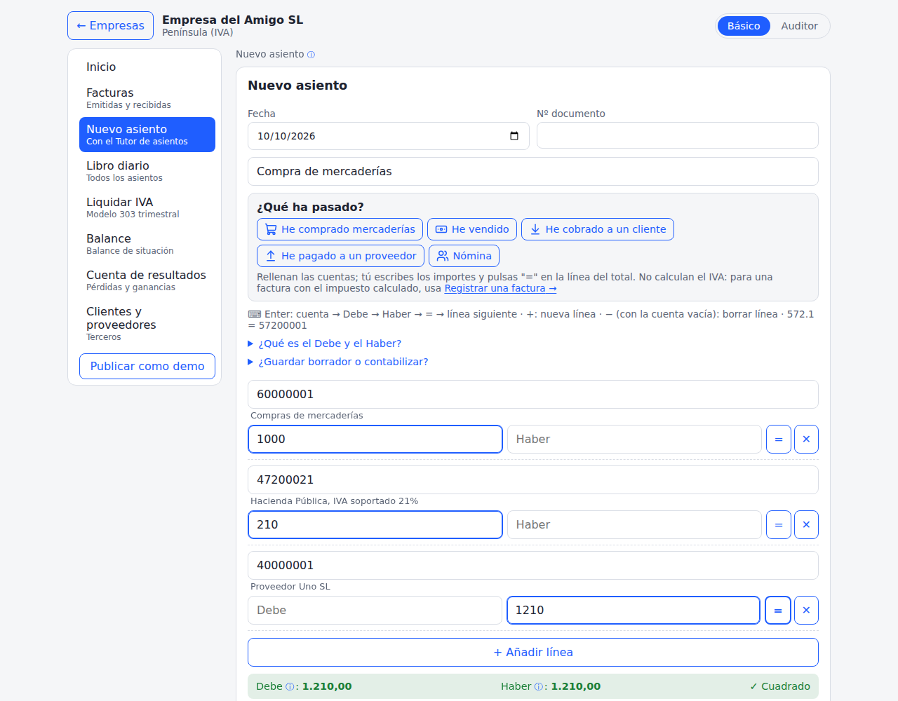
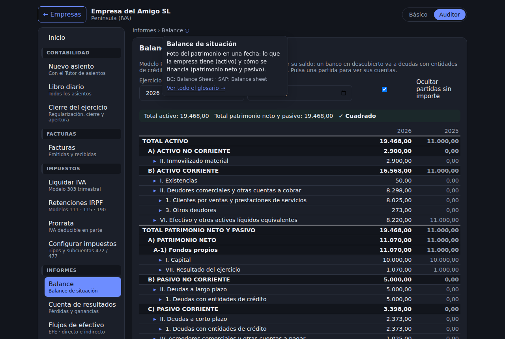
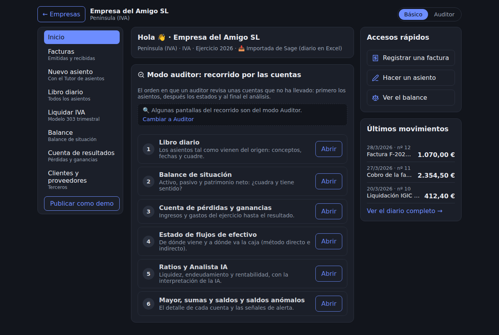

# Mini ERP · Contabilidad general española

[](https://github.com/Diosvely/MiniERP/actions/workflows/ci.yml)

**🔗 Demo en vivo:** [minierp-6ty.pages.dev/?demo](https://minierp-6ty.pages.dev/?demo). Entra como invitado,
**sin registrarte**, y consulta las empresas de ejemplo. O regístrate, crea tu empresa y contabiliza.

ERP web de **contabilidad general** para aprender contabilidad española (**PGC 2007, IVA e IGIC**) como lo haría
una gestoría. Cubre asientos, terceros, registro de facturas, liquidación trimestral, cierre del ejercicio, estados
financieros e informes de auditor. Además, importa contabilidades reales de otros ERP y añade **IA open source**
que interpreta los estados y propone asientos.
La estructura de datos se inspira en **Microsoft Dynamics 365 Business Central** y **SAP FI**. El registro de
facturas sigue a los ERP españoles (**A3, Sage, ContaPlus**), simplificado para que cada pieza se entienda.
Proyecto de aprendizaje en evolución.

> **English summary.** A web-based general ledger (mini ERP) built to learn Spanish accounting
> (Spanish GAAP – PGC 2007, VAT and Canary Islands IGIC). Features:
> - business partners and invoice registration with automatic VAT/IGIC, including withholdings, reverse charge,
>   equivalence surcharge and pro rata;
> - quarterly tax settlement (forms 303 / 420) and year-end closing;
> - balance sheet, income statement, cash flow statement (direct and indirect), financial ratios and audit reports;
> - an **auditor mode** that imports real journals from Sage and Business Central;
> - an open-source **AI analyst** and an **AI journal-entry tutor** whose proposals are validated by the ERP;
> - a guided home screen, a Basic / Auditor menu, plain-language error messages, journal-entry templates and an
>   in-app glossary with Business Central / SAP equivalents. Accessible: no axe-core issues (WCAG 2 A/AA).
>
> Data model inspired by Business Central and SAP FI. Database in English, bilingual UI (Spanish / English),
> multi-company and multi-user, with guest access to demo companies. Accounting rules are enforced by PostgreSQL,
> and every pull request is checked by CI. Learning project, work in progress.

| Inicio guiado | Asiento con plantilla |
|---|---|
|  |  |
| **Balance (modo oscuro) con el glosario** | **Modo auditor de una empresa importada** |
|  |  |

Más capturas: [pantalla de entrada](docs/capturas/01-entrada.png) · [errores en lenguaje claro](docs/capturas/06-errores-claros.png) · [Inicio en el móvil](docs/capturas/07-inicio-movil.png)

---

## ¿Por qué este proyecto?

Después de más de 15 años en control de gestión y costes, al llegar a España necesitaba dominar la contabilidad
española y el funcionamiento real de un ERP. Los ERP comerciales son caros y difíciles de practicar por cuenta
propia, así que decidí **construir uno**. Diseñar la tabla de asientos obliga a entender *por qué* un ERP impone
cada regla. Además, todo el código está en inglés para practicar el vocabulario técnico de BC y SAP.

## ¿Qué hace hoy? (v0.27.0)

**Primeros pasos y navegación**
- **Pantalla de Inicio** en cada empresa:
  - **ruta guiada** "Tu primer trimestre, paso a paso" (impuestos → tercero → factura → diario → liquidación →
    balance). Los pasos se marcan solos al hacerlos.
  - en las empresas importadas y las demos, un **recorrido de auditor** por las cuentas.
- **Modo Básico / Auditor:** un menú corto en lenguaje sencillo para quien empieza (8 entradas) o el menú completo
  por áreas para revisar.
- **Cada pantalla tiene su enlace** (`#/empresa/<id>/balance`): se puede recargar, volver atrás y compartir.
- Estados vacíos con la **siguiente acción** ("Configurar impuestos", "Hacer un asiento") y aviso de carga.
- **Errores en lenguaje claro:** cuando la base de datos rechaza algo, se explica qué ha pasado, qué hacer y se ofrece
  un botón para ir a la pantalla donde se arregla ("El asiento no cuadra: falta 210,00; pulsa =").
- **Pantalla de entrada** con la demo destacada, y acceso y registro accesibles.
- **Glosario dentro de la app:** un ⓘ junto a cada pantalla y a los términos clave explica el concepto, con su nombre
  en Business Central y SAP. Hay también una página de glosario con buscador.
- **Accesible:** sin fallos con axe-core (WCAG 2 A/AA) en modo claro y oscuro, todo se usa con el teclado, el idioma
  de la página sigue al elegido y los colores tienen contraste suficiente.

**Contabilidad**
- **Plan General Contable 2007** (grupos 1-7) con nombre oficial y traducción al inglés, copiado automáticamente a
  cada empresa. **Subcuentas** validadas e **importación desde CSV** con vista previa.
- **Empresas** por sector y territorio fiscal: **Península → IVA** o **Canarias → IGIC**. Ejercicios con 12
  periodos.
- **Asientos** con cuadre en vivo, manejo rápido con teclado (atajo del punto `572.1 = 57200001`, botón "=" y
  deshacer) y numeración correlativa sin huecos.
- **Plantillas "¿Qué ha pasado?"** (compra, venta, cobro, pago, nómina) que rellenan las subcuentas, y **buscador de
  cuentas por nombre** ("caja", "bancos").
- **Inmutabilidad:** un asiento contabilizado no se edita ni se borra; se **anula con contraasiento** (con fecha y
  motivo), como *Reverse Transaction* de BC o la FB08 de SAP.
- **Cierre del ejercicio:** regularización a la 129, cierre, apertura y reapertura, con confirmación en dos pasos.

**Terceros, IVA/IGIC y facturas** (modelo gestoría)
- **Terceros** (clientes 430, proveedores 400, acreedores 410, deudores 440) con su propia subcuenta y
  **validación de NIF/NIE/CIF**.
- **Configuración de impuestos** por tipo (472 soportado / 477 repercutido), con asistente para IVA o IGIC.
- **Registro de facturas** recibidas y emitidas, normales y **rectificativas**, con asiento automático, vista
  previa y libro registro. La **regla del lado** aplica a devoluciones (608/708), rappels (609/709) y pronto pago
  (606/706).
- **Casos especiales:**
  - retenciones IRPF (modelos 111 / 115 / 190);
  - operaciones exentas, exportaciones e intracomunitarias;
  - **inversión del sujeto pasivo**;
  - **recargo de equivalencia**;
  - **prorrata general** con regularización anual.
- **Liquidación trimestral** (modelos **303 IVA / 420 IGIC**):
  - compensación de cuotas y devolución en el 4T;
  - cuadre *libro registro ↔ contabilidad*;
  - bloqueo del trimestre declarado.

**Estados financieros e informes (mirada de auditor)**
- **Balance de situación** y **cuenta de pérdidas y ganancias** (modelo PYMES del PGC), con desglose hasta la
  subcuenta.
- **Estado de flujos de efectivo** por el método **directo** y el **indirecto**, con el cuadre del auditor entre
  los dos.
- **Ratios:**
  - liquidez, solvencia, endeudamiento y rentabilidad;
  - periodos medios de cobro y de pago;
  - zonas de referencia y explicación de cada uno.
- **Libro diario**, **sumas y saldos**, **libro mayor** y **saldos anómalos** (saldo contrario a su naturaleza y
  reclasificación al cierre).

**Modo auditor: contabilidades reales**
- **Importación de diarios** de **Sage** (Excel) y **Business Central**: vista previa, creación de subcuentas,
  contabilización mes a mes y cierre de cada ejercicio.
- Las empresas importadas son privadas. Se publican como demo **solo si su titular lo decide**, con su mención y
  con datos anonimizados.

**Inteligencia artificial** (Cloudflare Workers AI, modelos open source)
- **Analista IA:** interpreta el balance, la PyG, el EFE y los ratios ya calculados (fortalezas, alertas y
  preguntas del auditor). Solo recibe **cifras agregadas**: nunca nombres de empresas, terceros ni conceptos.
- **Tutor de asientos:** describes una operación ("factura de la abogada de 1.000 € más IVA") y la IA propone el
  asiento.
  - **El ERP lo valida**: impuestos de nuestras tablas, subcuentas reales, normas de valoración y reglas de
    criterio.
  - **Tú decides** si cargarlo en el formulario.
- Cuota diaria por usuario y **opiniones sobre cada respuesta** para mejorar la IA.

**Plataforma**
- **Roles al estilo Microsoft:**
  - **Administrador** (el propietario);
  - **Miembro**: el titular de los datos de una empresa importada, que trabaja en ella, usa la IA con cuota y
    decide si se publica como demo;
  - **Colaborador**: se registra y lleva sus empresas;
  - **Visor**: los invitados que ven las demos.
- **Multiusuario y multiempresa** con roles por empresa (admin, contable, lectura) mediante *Row Level Security*.
- **Empresas DEMO** de solo lectura y **acceso como invitado sin registro**.
- **Español / inglés** con selector de bandera, en móvil y en ordenador.

## Arquitectura

| Capa | Tecnología | Notas |
|---|---|---|
| Base de datos | **PostgreSQL** en Supabase (schema `erp`) | Las reglas contables viven en la base de datos: triggers, funciones y RLS |
| Autenticación | Supabase Auth | Correo y contraseña · invitados con *anonymous sign-ins* |
| Web | **React + Vite** | Componentes por pantalla, i18n propio (es/en), rutas con almohadilla, iconos `lucide-react` |
| IA | **Cloudflare Workers AI** + Pages Functions | `/api/ai` (Mistral Small 3.1) y `/api/tutor` (gpt-oss-120b); la clave nunca llega al navegador |
| Despliegue | **Cloudflare Pages** | Despliegue automático desde `main` y dirección de prueba por rama |
| Calidad | **GitHub Actions** | Pruebas SQL, lint, build y auditoría de dependencias en cada Pull Request |
| Versionado | Git + GitHub | Ramas, Pull Requests, `main` protegida, versiones etiquetadas y decisiones documentadas (ADR) |

**Principio clave:** la web nunca es la única barrera. Aunque alguien manipule el navegador, PostgreSQL rechaza:
- un asiento descuadrado;
- una factura duplicada;
- una escritura en una empresa ajena o de un invitado;
- la edición de un asiento contabilizado;
- el uso de la IA sin permiso o por encima de la cuota.

## Modelo de datos (resumen)

| Tabla | Equivalente BC | Equivalente SAP |
|---|---|---|
| `companies` | Company | Company Code (BUKRS) |
| `fiscal_years` / `accounting_periods` | Accounting Periods | Fiscal Year / Posting Periods |
| `coa_template` / `gl_accounts` | G/L Account | Chart of Accounts (SKA1 / SKB1) |
| `business_partners` | Customer / Vendor | Business Partner |
| `tax_codes` / `tax_setup` | VAT Product Posting Group / VAT Posting Setup | Tax Code (MWSKZ) / OB40 |
| `journal_entries` / `journal_lines` | G/L Entries | BKPF / BSEG |
| `invoices` / `invoice_tax_lines` | Posted Purchase / Sales Invoices · VAT Entries | FB60 / FB70 · BSET |
| `tax_settlements` | Calc. and Post VAT Settlement | RFUMSV00 |
| `year_closings` | Close Income Statement | Saldos a cuenta nueva (F.16 / FAGLGVTR) |
| `import_batches` / `import_lines` | Configuration Packages / Data Migration | LSMW · Migration Cockpit |
| `cf_lines` / `cf_mapping` | Financial Reports (Cash Flow) | Cash Flow Statement (FS item mapping) |
| `ratio_defs` | Analysis Views / KPIs | Financial Statement Version · KPIs |
| `balance_rules` | — | — (regla de auditoría: naturaleza del saldo) |
| `company_users` / `app_profiles` / `ai_feedback` | Permission Sets · User Setup | Roles (PFCG) |

Detalle en [`docs/modelo-datos.md`](docs/modelo-datos.md) y vocabulario español ↔ inglés ↔ BC ↔ SAP en
[`docs/glosario.md`](docs/glosario.md).

## Documentación

- [Bitácora](docs/bitacora.md): diario del proyecto, versión a versión, con lo aprendido.
- [Decisiones (ADR)](docs/decisiones/): por qué se eligió cada cosa.
- [Guía de Git del proyecto](docs/guia-git.md): plantilla para crear ramas, hacer Pull Requests y versionar.
- [CHANGELOG](CHANGELOG.md): cambios de cada versión.

## Estructura del repositorio

```
├── .github/workflows/ci.yml   integración continua: pruebas SQL, lint, build y auditoría
├── scripts/test-db.sh         ejecuta todas las pruebas SQL, cada una en una base limpia
├── database/
│   ├── migrations/            0001 → 0027, se ejecutan en orden en Supabase
│   ├── reset/                 reset del schema antiguo (solo histórico)
│   ├── seed/                  datos de ejemplo (opcional)
│   └── tests/                 pruebas automáticas en SQL (fases 1 → 21) y simulador de Supabase
├── frontend/                  web React + Vite
│   ├── functions/api/         Pages Functions: ai.js (Analista IA) y tutor.js (Tutor de asientos)
│   └── src/
│       ├── components/        Inicio, empresas, menú, asientos, diario, facturas, impuestos, informes, IA…
│       ├── i18n/              diccionarios es.js / en.js y motor de idioma
│       ├── router.js          rutas #/empresa/<id>/<pantalla>
│       ├── activity.js        aviso "Cargando…" global
│       ├── errors.js          errores de la base de datos en lenguaje claro
│       ├── templates.js       plantillas de asientos frecuentes
│       ├── glossary.js        glosario de la app (es/en, con su nombre en BC y SAP)
│       ├── icons.js           tamaño común de los iconos (lucide-react)
│       ├── importers.js       lectura de diarios de Sage y Business Central
│       ├── format.js          formato de importes y nombres de cuenta
│       └── supabase.js        conexión con la base de datos (solo clave publicable)
└── docs/
    ├── bitacora.md            diario del proyecto
    ├── guia-git.md            guía de Git (plantilla)
    ├── modelo-datos.md        tablas, funciones, vistas
    ├── glosario.md            vocabulario contable bilingüe
    ├── capturas/              capturas de la app para el README
    └── decisiones/            ADR 0001 → 0024
```

## Calidad

- **Integración continua** (GitHub Actions) en cada Pull Request:
  - las 21 pruebas de la base de datos sobre PostgreSQL 16, cada una en una base limpia con todas las migraciones;
  - lint, build y auditoría de dependencias de la web.
- **Accesibilidad** comprobada con axe-core (WCAG 2 A/AA) en las pantallas principales, en modo claro y oscuro.
- La rama `main` está protegida: solo se fusiona con los checks en verde.

## Instalación propia

1. **Base de datos.** En un proyecto de Supabase → *SQL Editor*, ejecuta en orden `database/migrations/0001` …
   `0027`.
2. **API.** En *Project Settings → Data API → Exposed schemas*, añade `erp`.
3. **Invitados** (opcional, **después** de la migración 0015): *Authentication → Sign In / Providers* → activa
   **Allow anonymous sign-ins**.
4. **Propietario.** Nombra tu usuario como *owner* (solo desde el SQL Editor: nadie puede hacerse owner desde la
   web):
   ```sql
   insert into erp.app_profiles (user_id, app_role, max_companies)
   select id, 'owner', null from auth.users where email = 'tu-correo@ejemplo.com';
   ```
   Para dar acceso a otra persona a una empresa: que se registre (o créala en *Authentication › Users › Add
   user*) y después, en la empresa, abre **Accesos** (modo Auditor).
5. **Web.** En `frontend/`, crea `.env.local` (nunca se sube a Git; usa solo la clave **publicable**):
   ```
   VITE_SUPABASE_URL=https://TU-PROYECTO.supabase.co
   VITE_SUPABASE_KEY=sb_publishable_...
   ```
   Después:
   ```bash
   npm install
   npm run dev
   ```
6. **Despliegue.** En Cloudflare Pages:
   - *Root directory*: `frontend`
   - *Build command*: `npm run build`
   - *Output directory*: `dist`
   - Variables `VITE_SUPABASE_URL` y `VITE_SUPABASE_KEY`.
7. **IA** (opcional). En Cloudflare Pages:
   - en *Settings → Bindings*, añade un binding de **Workers AI** llamado `AI`, tanto en **Production** como en
     **Preview**;
   - las funciones de `/api` usan las mismas variables `VITE_SUPABASE_URL` y `VITE_SUPABASE_KEY` del paso 6, y
     `AI_MODEL` / `TUTOR_MODEL` son opcionales, para probar otro modelo;
   - vuelve a desplegar, porque los bindings solo se aplican a los despliegues nuevos;
   - el plan gratuito incluye 10.000 *neuronas* al día.

### Pruebas de la base de datos (PostgreSQL local)

Con PostgreSQL instalado (Linux, WSL o Git Bash):

```bash
bash scripts/test-db.sh            # las 21 pruebas, cada una en una base limpia
bash scripts/test-db.sh fase21     # solo las que contienen "fase21"
```

## Hoja de ruta

- [x] **v0.1.0**: base de datos contable (PGC, asientos, informes en SQL, RLS)
- [x] **v0.2.0**: base de datos en inglés al estilo BC/SAP e interfaz bilingüe
- [x] **v0.3.0**: plan de cuentas, asientos con cuadre en vivo y libro diario en la web
- [x] **v0.4.0**: empresas demo de solo lectura y límites por usuario
- [x] **v0.5.0**: importación de subcuentas desde CSV con vista previa y validación
- [x] **v0.6.0**: terceros con subcuenta automática y validación de NIF/NIE/CIF
- [x] **v0.7.0**: configuración de impuestos IVA/IGIC
- [x] **v0.8.0**: registro de facturas recibidas y emitidas, rectificativas y libro registro
- [x] **v0.9.0**: liquidación trimestral de IVA/IGIC (modelos 303 / 420)
- [x] **v0.10.0**: sumas y saldos, libro mayor y saldos anómalos
- [x] **v0.11.0 – v0.13.1**: menú por áreas, diario con rango de fechas, anulación de asientos, demo sin registro y selector de idioma con bandera
- [x] **v0.14.0**: balance de situación y PyG (modelo PYMES del PGC)
- [x] **v0.15.0**: cierre del ejercicio (regularización, cierre, apertura y reapertura)
- [x] **v0.16.0**: retención IRPF (111/115) y operaciones exentas, exportaciones, intracomunitarias y no sujetas
- [x] **v0.17.0**: inversión del sujeto pasivo, adquisiciones intracomunitarias y recargo de equivalencia
- [x] **v0.18.0**: prorrata general (casos especiales de IVA/IGIC completos)
- [x] **v0.19.0**: Modo auditor (1): importación de diarios de Sage y Business Central
- [x] **v0.20.0**: Modo auditor (2): estado de flujos de efectivo por los dos métodos, con cuadre del auditor
- [x] **v0.21.0**: Modo auditor (3): ratios (liquidez, solvencia, endeudamiento, rentabilidad, PMC / PMP)
- [x] **v0.22.0**: Analista IA con modelos open source (Cloudflare Workers AI)
- [x] **v0.23.0**: Tutor de asientos con IA, validado por el ERP
- [x] **v0.24.0**: accesos y titulares de los datos (rol Miembro), cuota de IA y opiniones sobre la IA
- [x] **v0.25.0**: Inicio guiado, modo Básico/Auditor, rutas, estados vacíos y de carga, integración continua
- [x] **v0.26.0**: errores en lenguaje claro, pantalla de entrada y plantillas de asientos
- [x] **v0.27.0**: glosario en la app, accesibilidad, colores e iconos, capturas en el README
- [ ] v0.28.0: seguridad (cabeceras, endurecer la IA, CAPTCHA, limpieza de invitados y tests de la web)
- [ ] Inmovilizado: fichas de activos, plan de amortización y asiento mensual a contabilidad
- [ ] Inventario y nóminas
- [ ] IA: supuestos prácticos autocorregidos
- [ ] Presupuesto frente a real (hojas "Ppto" de los ficheros importados)
- [ ] Puente a Power BI (vistas para conectar directamente)

*Proyecto de estudio: los tipos impositivos y las reglas fiscales se contrastan con la AEAT y la ATC; no es
asesoramiento fiscal. Las respuestas de la IA son orientativas y siempre se revisan antes de contabilizar.*

## Autor

**Diosvely Perez Arteaga** · Controller financiero en transición hacia Data & ERP · Canarias, España.
Proyecto personal de aprendizaje: sugerencias y comentarios bienvenidos en *Issues*.