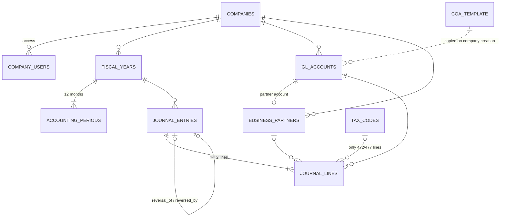

# Modelo de datos · Data model (v0.2.0)

Todo vive en el schema `erp` de PostgreSQL (Supabase). Nombres en inglés al estilo BC / SAP;
vocabulario completo en [glosario.md](glosario.md).

## Diagrama

## Tablas · Tables

| Tabla | Qué guarda | Business Central | SAP FI |
|---|---|---|---|
| `companies` | Sociedad, sector (`industry`), territorio fiscal, longitud de subcuentas | Company | Company Code (T001) |
| `company_users` | Usuario ↔ empresa con rol (admin, accountant, viewer) | User Permissions | Authorizations |
| `user_settings` | Preferencias del usuario: idioma de la interfaz | User Settings | User Parameters |
| `fiscal_years` / `accounting_periods` | Ejercicio y sus 12 meses abrir/cerrar | Accounting Periods | Fiscal Year Variant / OB52 |
| `coa_template` | PGC 2007 grupos 1-7 (352 cuentas) con `name` y `name_en` | Configuration package | Chart of Accounts (SKA1) |
| `gl_accounts` | Plan de la empresa: cuentas `heading` + subcuentas `posting` | G/L Account | G/L Account (SKB1) |
| `business_partners` | Clientes, proveedores, acreedores, deudores | Customer / Vendor | Business Partner |
| `tax_codes` | Tipos IVA / IGIC con vigencia | VAT Posting Setup | Tax Code (MWSKZ) |
| `journal_entries` | Cabecera: fecha, concepto, nº, estado | Document No. | BKPF |
| `journal_lines` | Líneas: cuenta, debit, credit, tercero, impuesto | G/L Entry | BSEG |

## Funciones · Functions (desde la web: `supabase.rpc(...)`)

| Función | Qué hace |
|---|---|
| `create_fiscal_year(company, year)` | Crea el ejercicio y sus 12 periodos |
| `create_posting_account(company, account_no, name, name_en?)` | Alta de subcuenta; valida longitud y cuenta PGC madre |
| `post_entry(entry)` | Valida y numera; el asiento queda bloqueado |
| `reverse_entry(entry, posting_date?)` | Contraasiento automático |
| `trial_balance(company, year, level?, to_date?)` | Sumas y saldos a nivel 1, 2, 3 o subcuenta |
| `delete_company(company)` | Borra una empresa de práctica (solo admin) |

## Vistas · Views

| Vista | Informe |
|---|---|
| `v_general_journal` | Libro diario |
| `v_general_ledger` | Libro mayor con `running_balance` |
| `v_tax_book` | Libro registro de IVA / IGIC (`input` / `output`) |

## Convención de subcuentas (8 dígitos)

| Subcuenta | Uso |
|---|---|
| `4720 00 21` | IVA soportado 21 % · Input VAT 21 % |
| `4721 00 07` | IGIC soportado 7 % · Input IGIC 7 % |
| `4770 00 21` | IVA repercutido 21 % · Output VAT 21 % |
| `4771 00 07` | IGIC repercutido 7 % · Output IGIC 7 % |
| `4751 00 01` | Retenciones IRPF practicadas · Withholdings payable |

El PGC solo habla de IVA en las cuentas 472 y 477; en Canarias se usan esas mismas cuentas para el IGIC,
distinguiéndolo con subcuentas.
