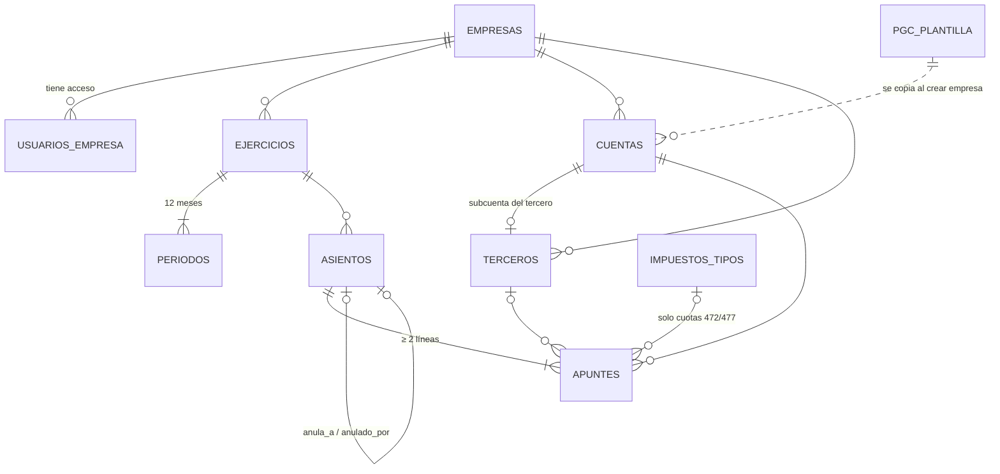

# Modelo de datos · v0.1.0

Todo vive en el schema `conta` de PostgreSQL (Supabase).

## Diagrama

## Tablas y equivalencias

| Tabla | Qué guarda | Business Central | SAP FI |
|---|---|---|---|
| `empresas` | Sociedad, sector, territorio fiscal, longitud de subcuentas | Company | Sociedad (T001 / BUKRS) |
| `usuarios_empresa` | Usuario ↔ empresa con rol | User Permissions | Autorizaciones por sociedad |
| `ejercicios` / `periodos` | Año contable y sus 12 meses abrir/cerrar | Accounting Periods | Variante de ejercicio / OB52 |
| `pgc_plantilla` | PGC 2007 grupos 1-7 (352 cuentas) | Plantilla de configuración | Plan de cuentas (SKA1) |
| `cuentas` | Plan de la empresa: cuentas título + subcuentas | G/L Account (Heading / Posting) | Cuenta a nivel sociedad (SKB1) |
| `terceros` | Clientes, proveedores, acreedores, deudores | Customer / Vendor | KNA1 / LFA1 |
| `impuestos_tipos` | Tipos IVA / IGIC con vigencia | VAT Product Posting Group | Indicador de IVA (MWSKZ) |
| `asientos` | Cabecera: fecha, concepto, nº, estado | Document No. | BKPF |
| `apuntes` | Líneas: cuenta, Debe, Haber, tercero, impuesto | G/L Entry | BSEG |

## Funciones (se llaman desde la web con `supabase.schema('conta').rpc(...)`)

| Función | Qué hace |
|---|---|
| `crear_ejercicio(empresa, año)` | Crea el ejercicio y sus 12 periodos |
| `crear_subcuenta(empresa, código, nombre)` | Alta de subcuenta; valida longitud y cuenta PGC madre |
| `contabilizar(asiento)` | Valida y numera; el asiento queda bloqueado |
| `anular(asiento, fecha?)` | Contraasiento automático |
| `sumas_saldos(empresa, año, nivel?, hasta?)` | Balance de sumas y saldos a nivel 1, 2, 3 o subcuenta |
| `eliminar_empresa(empresa)` | Borra una empresa de práctica (solo admin) |

## Vistas

| Vista | Informe |
|---|---|
| `v_libro_diario` | Libro diario |
| `v_libro_mayor` | Libro mayor con saldo acumulado |
| `v_libro_impuestos` | Libro registro de IVA / IGIC soportado y repercutido |

## Convención de subcuentas (8 dígitos)

| Subcuenta | Uso |
|---|---|
| `4720 00 21` | IVA soportado 21 % |
| `4721 00 07` | IGIC soportado 7 % |
| `4770 00 21` | IVA repercutido 21 % |
| `4771 00 07` | IGIC repercutido 7 % |
| `4751 00 01` | Retenciones IRPF practicadas |

El PGC solo habla de IVA en las cuentas 472 y 477; en Canarias se usan esas mismas cuentas para el IGIC
distinguiéndolo con subcuentas.
